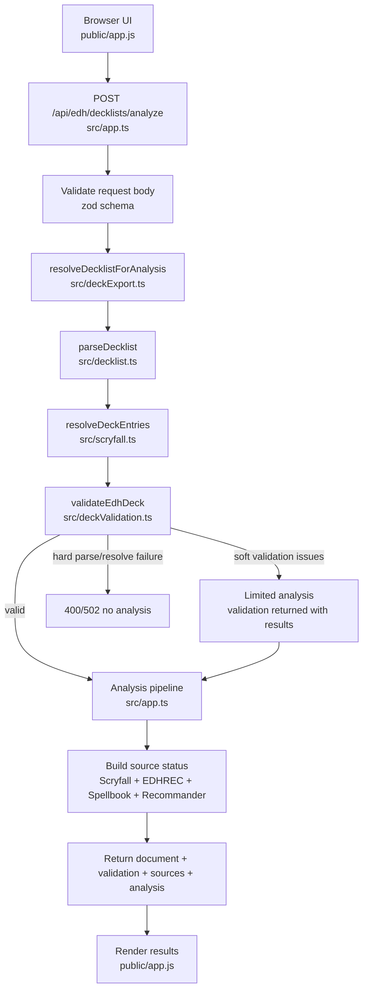
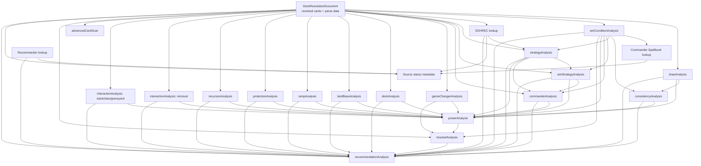
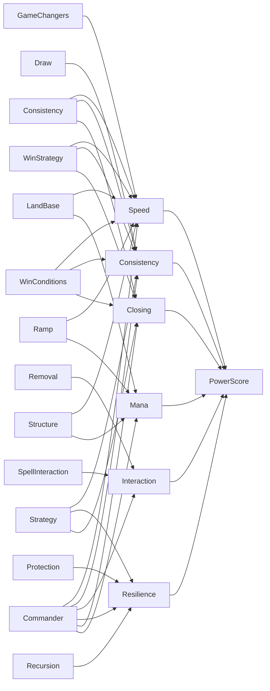
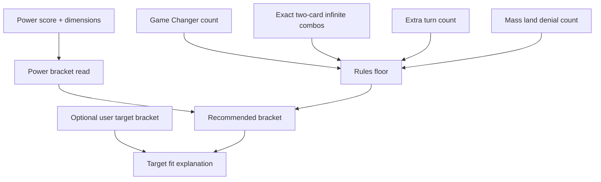

# Analysis Flow

This document explains how a submitted EDH decklist moves through the app, how the final analysis is assembled, and where the current weak spots are likely to be.

## Request Flow

Important detail: `/api/edh/decklists/analyze` now uses a lenient resolver. Soft EDH validation issues are returned with the analysis so the UI can show a clear "Analysis Limited" warning. Strict flows such as `/api/edh/decklists/resolve` and `/api/edh/decklists/export` still reject invalid EDH decks.

## Analysis Dependency Graph

## Result Calculation

| Result area | Main source file | Main inputs | Output role |
| --- | --- | --- | --- |
| `document` | `src/deckExport.ts` | raw decklist, commander options, Scryfall cards, validation | The canonical resolved deck object used by every later step. |
| `sources` | `src/app.ts` | document, EDHREC, Commander Spellbook, Recommander, recommendations | Reports whether each external source was ready, partial, or failed, and which result areas may be affected. |
| `structure` | `src/deckAnalysis.ts` | resolved deck cards | Counts lands, card types, curve, average mana value, and baseline shell health. |
| `landBase` | `src/landBaseAnalysis.ts` | resolved deck cards | Scores land count, tapped lands, fixing, fetches, utility lands, and risky lands. |
| `ramp` | `src/rampAnalysis.ts` | resolved deck cards | Finds stable ramp, burst mana, land acceleration, fixing, and cost reduction. |
| `draw` | `src/drawAnalysis.ts` | resolved deck cards | Finds draw, card selection, and repeatable card advantage. |
| `consistency` | `src/consistencyAnalysis.ts` | document, draw, strategy, win conditions | Scores tutors, access effects, selection support, and combo consistency. |
| `protection` | `src/protectionAnalysis.ts` | resolved deck cards | Finds broad protection, targeted protection, bounce, flicker, and equipment protection. |
| `recursion` | `src/recursionAnalysis.ts` | resolved deck cards | Scores graveyard, hand, replay, mass, and library recursion. |
| `removal` | `src/interactionAnalysis.ts` | resolved deck cards | Scores targeted removal, sweepers, tempo answers, and hand attack. |
| `spellInteraction` | `src/interactionAnalysis.ts` | resolved deck cards | Scores counterspells, stack interaction, stax pieces, and graveyard hate. |
| `winConditions` | `src/winConditionAnalysis.ts` | document, Commander Spellbook | Finds finishers and exact combo lines. |
| `strategy` | `src/strategyAnalysis.ts` | document, win conditions, EDHREC, user strategy preference | Detects the main archetype, sub-strategies, key cards, and synergy. |
| `winStrategy` | `src/winStrategyAnalysis.ts` | document, strategy, win conditions | Explains how the deck is expected to win. |
| `commander` | `src/commanderAnalysis.ts` | document, strategy, win strategy, win conditions | Scores command-zone impact, dependency, ceiling, roles, and commander involvement in combos. |
| `power` | `src/powerAnalysis.ts` | most analysis modules | Combines dimensions into power index, power score, tier, strengths, and weaknesses. |
| `bracket` | `src/bracketAnalysis.ts` | document, power, game changers, win conditions, target bracket | Turns the power read and bracket rule signals into the recommended Commander bracket. |
| `recommendations` | `src/recommendationAnalysis.ts` | most analysis modules, EDHREC, Recommander | Suggests upgrade or downshift cards based on gaps and target bracket. |

## Power Score Shape

`src/powerAnalysis.ts` does not simply average all module scores. It builds six weighted dimensions first:

The final `powerScore` is derived from an internal `powerIndex`. After the weighted dimensions are combined, extra adjustments are applied for combo pressure, commander impact, game changers, plan clarity, weak ramp, weak draw, weak interaction, and weak mana.

## Bracket Calculation Shape

The recommended bracket is the higher value between the power read and the rules floor. For example, a lower-power deck can still be lifted by Game Changers, compact two-card combos, repeated extra turns, or mass land denial.

## Key Weak Spots

| Area | Why it can be fragile | Where to inspect first |
| --- | --- | --- |
| Limited-analysis confidence | Invalid or incomplete decks can now receive partial analysis, but those results are less reliable and must stay clearly marked in the UI. | `src/deckExport.ts`, `src/app.ts`, `public/app.js`, `public/deck-identity.js` |
| External service dependence | Scryfall is required for card resolution. Commander Spellbook, EDHREC, and Recommander can change or fail independently. The `sources` result must make that visible immediately. | `src/scryfall.ts`, `src/commanderSpellbook.ts`, `src/edhrec.ts`, `src/recommander.ts`, `src/app.ts` |
| Regex-based card role detection | Many effects are inferred from oracle text patterns. New card wording can be missed or misclassified. | `src/advancedCardScan.ts`, `src/drawAnalysis.ts`, `src/rampAnalysis.ts`, `src/interactionAnalysis.ts` |
| Large strategy rules file | Strategy detection has many overlapping archetype rules, so small changes can affect many decks. | `src/strategyAnalysis.ts`, `src/strategyAnalysis.test.ts` |
| Large recommendation rules file | Recommendations combine static cards, bracket target, EDHREC, Recommander, and weak-topic logic. Priority bugs can be subtle. | `src/recommendationAnalysis.ts`, `src/recommendationAnalysis.test.ts` |
| Score explainability | Power score is weighted and then adjusted, so a surprising final number may require checking several modules. | `src/powerAnalysis.ts`, `src/bracketAnalysis.ts` |
| Frontend response coupling | The browser expects many specific analysis fields. Backend response changes can silently break rendering. | `public/app.js`, `src/types.ts` |

## Debugging A Suspicious Result

1. Check `document.result.resolvedCards` first. Bad card resolution poisons every later result.
2. Check validation issues and commander section assignment. Wrong commander identity changes color profile, strategy, and recommendations.
3. Inspect the focused module result before looking at power. For example, debug `ramp` before debugging `power.speed`.
4. Inspect `strategy` and `winStrategy` before `commander`, `power`, `bracket`, and `recommendations`, because several later modules depend on them.
5. If bracket looks too high, inspect `bracket.signals` for Game Changers, exact two-card combos, extra turns, and mass land denial.
6. Check `sources` before trusting a surprising result. If EDHREC, Commander Spellbook, or Recommander is limited, the affected strategy, combo, bracket, or recommendation sections may be less complete.
7. If recommendations look odd, inspect target bracket, weak topic scores, EDHREC context, and whether Recommander cards were classified into a topic.

## Fast Orientation

For the normal analyze endpoint, the exact orchestration order is in `src/app.ts` inside `POST /api/edh/decklists/analyze`. The best tests for understanding intended behavior are usually the matching `*.test.ts` files next to each module.
